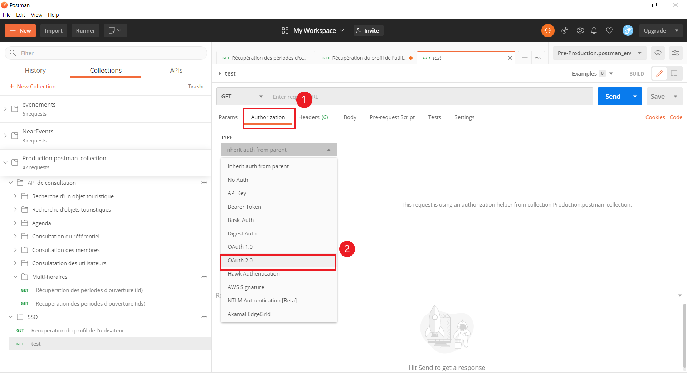
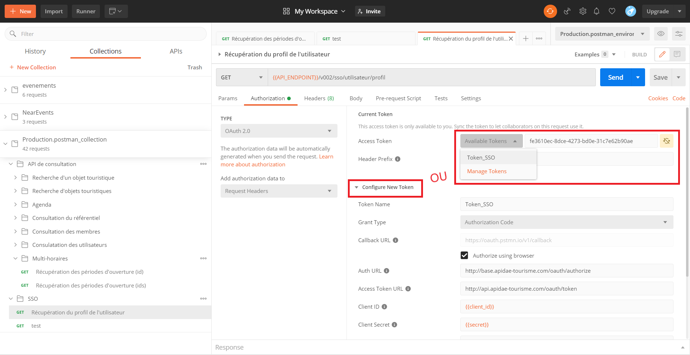
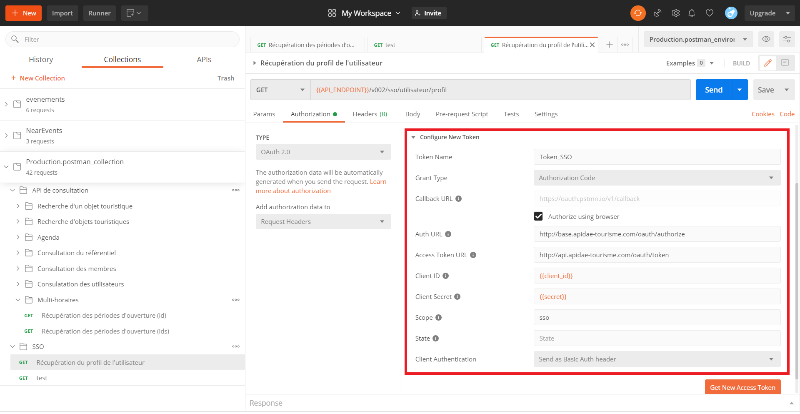
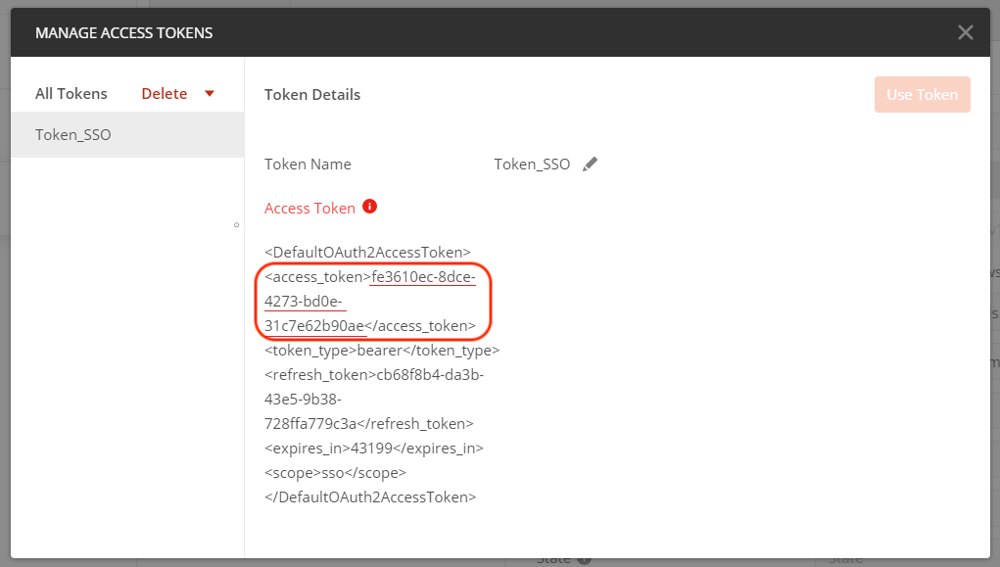
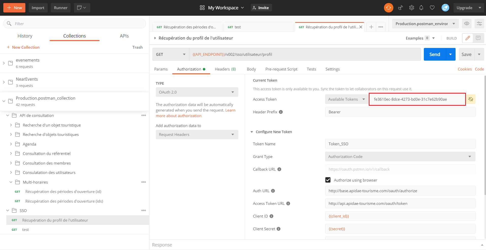
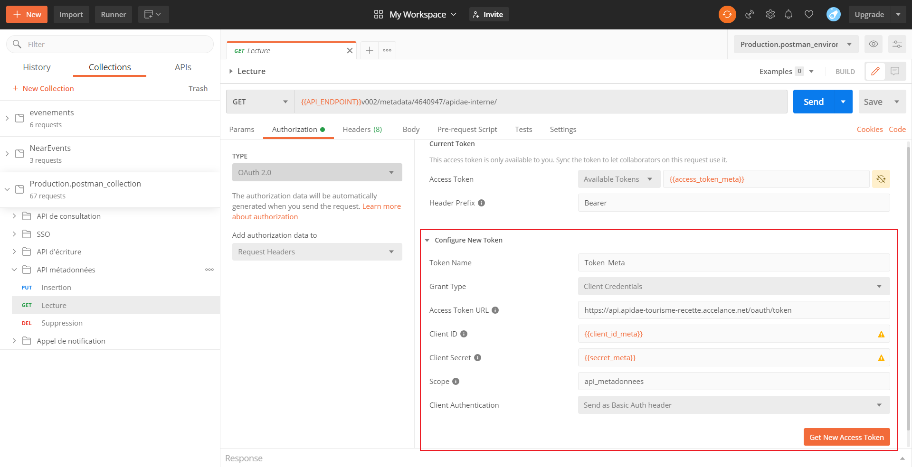

## Documentation pour la création de tokens pour OAuth2 avec Postman

### Autorisation

Tout d'abord avant de rentrer dans le vif du sujet : il faut dans un premier temps comprendre comment fonctionne l'autorisation.

La première phase consiste à autoriser le client à se connecter au compte de l’utilisateur. Pour cela on fait appel au webservice *authorize*. Une fois l’autorisation accordée, le service redirige l’utilisateur vers la récupération du token se fera via le webservice *token*.

##### Les informations utiles :

- Autorisation URL (Auth URL) : http://base.apidae-tourisme.com/oauth/authorize
- URL de récupération de token (Access Token URL) : http://api.apidae-tourisme.com/oauth/token
- Liste des scopes non exhaustive :
  * `sso`
  * `api_ecriture`
  * `api_metadonnees`

### Postman SSO

#### 	Single Sign On

Postman utilise des tokens pour gérer les autorisations, notamment avec le système OAuth 2.0, pour les requêtes qui utilisent du SSO (Single Sign On).

**Attention** l’utilisation du SSO requiert la création d’un projet de type SSO (dans *Diffuser > Projets > Mes projets*) et d’un client pour ce projet afin de pouvoir continuer. **Cependant **une fois les prérequis réunis tous les comptes utilisateurs authentifiés (membre, extranet, …) de la plateforme Apidae peuvent bénéficier du SSO.

#### 	Configuration

1. Dans l'onglet de la requête sélectionner Authorization et choisir le type OAuth 2.0

   

2. **Si** vous possédez déjà un Access Token vous aurez juste à sélectionner **Manage Tokens** dans le menu déroulant de la partie *Curent Token* puis de copier/coller l'*access token* dans le champs associé. **Sinon** vous devrez utiliser la deuxième partie de la fenêtre *Configure New Token*

   

3. Pour remplir les champs de la partie *Configure New Token* il vous suffit de suivre ces points :

   - Sélectionner le **Grant type** : *Authorization Code*
   - **Callback URL** l'url spécifié dans le projet dans la case **URLs de redirection autorisées**
   - Vous pouvez cocher la case **Authorize using browser** pour que la page s'ouvre dans votre navigateur plutôt que dans Postman
   - **Auth URL** ainsi que le **Access Token URL** correspondent aux URL renseignées ci-dessus.
   - Le **Client ID** est disponible au niveau de votre projet et le **Client secret** à du vous être envoyé à l'adresse mail spécifiée lors de la création du client.
   - Ici le **Scope** correspond à la valeur *sso*
   - Le champ **State** est facultatif

4. Pour finir il vous suffit de cliquer sur **Get New Access Token** pour générer le nouveau token. Vous disposez maintenant de votre token mais Postman ne le récupère pas automatiquement, il vous faudra copier/coller l'*access token* dans la partie **Current Token**.

5. Et voila vous n'avez plus qu'à envoyer votre requête ! **Attention** il faudra surement rafraichir le token de temps à autre.

### Postman API Écriture et Métadonnées

#### 	Configuration

1. Dans l'onglet de la requête sélectionner Authorization et choisir le type OAuth 2.0

   

2. **Si** vous possédez déjà un Access Token vous aurez juste à sélectionner **Manage Tokens** dans le menu déroulant de la partie *Curent Token* puis de copier/coller l'*access token* dans le champs associé. **Sinon** vous devrez utiliser la deuxième partie de la fenêtre *Configure New Token*

   

3. Pour remplir les champs de la partie *Configure New Token* il vous suffit de suivre ces points :

   - Sélectionner le **Grant type**: *Client Credentials*
   - Le **Access Token URL** correspondent à URL renseignée ci-dessus dans les `Informations utiles`.
   - Le **Client ID** est disponible au niveau de votre projet et le **Client secret** à du vous être envoyé à l'adresse mail spécifiée lors de la création du client.
   - Ici le **Scope** correspond à la valeur `api_ecriture` ou `api_metadonnees`

   

4. Pour finir il vous suffit de cliquer sur **Get New Access Token** pour générer le nouveau token. Vous disposez maintenant de votre token mais Postman ne le récupère pas automatiquement, il vous faudra copier/coller l'*access token* dans la partie **Current Token**.

5. Et voila vous n'avez plus qu'à envoyer votre requête ! **Attention** il faudra surement rafraichir le token de temps à autre.