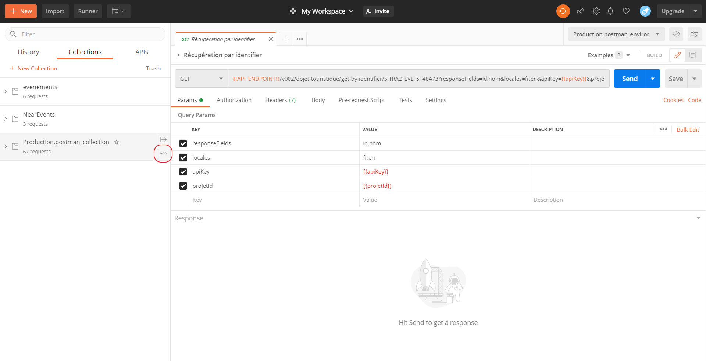
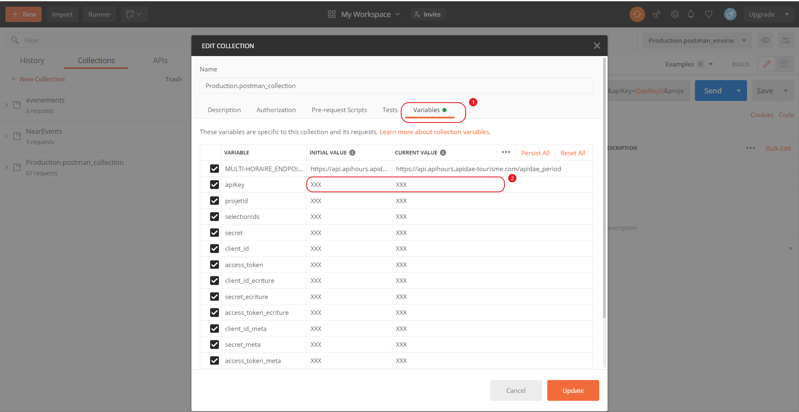

# Collection Postman de requêtes Apidae

Cette collection [Postman](https://www.postman.com/) permet de se familiariser avec les différents types d'API que propose [Apidae](https://www.apidae-tourisme.com/) au travers d'exemples variés. Il existe également deux environnements : la **Production** et la **Recette**. Pour les APIs de consultation ainsi que le SSO vous pouvez utiliser l'environnement de `Apidae-Production` mais pour les autres type de requête il faut utiliser celui de `Apidae-Recette`.

### La liste des exemples disponibles

- **APIs de consultation** - [documentation](http://dev.apidae-tourisme.com/fr/documentation-technique/v2/api-de-diffusion)
  * Lecture des sélections d'un projet
  * Lecture d'un objet touristique
  * Recherche d'objets touristiques
  * Agenda
  * Consultation du référentiel
  * Consultation des membres
  * Consultation des utilisateurs
* Multi-horaires
  
- **Single Sign On (SSO)** - [documentation](http://dev.apidae-tourisme.com/fr/documentation-technique/v2/oauth/single-sign-on)
- **APIs d'écriture** - [documentation](http://dev.apidae-tourisme.com/fr/documentation-technique/v2/api-decriture)
  * Création
  * Modification
  * Suppression

- **APIs de métadonnées** - [documentation](http://dev.apidae-tourisme.com/fr/documentation-technique/v2/metadonnees)
- **Appel de notification** - [documentation](http://dev.apidae-tourisme.com/fr/documentation-technique/v2/exports/notificationi-traitement-confirmation)

### Liste des paramètres

Avant toute utilisation de la collection, il est important de renseigner les variables de collection pour le bon fonctionnement des requêtes. 

1. Survolez votre collection avec le pointeur, puis cliquez sur les 3 points et enfin sélectionnez `edit` dans le menu déroulant

2. Rendez vous dans l'onglet `Variables` (1) puis dans un second temps vous n'aurez plus qu'à remplacer les `XXX` par vos valeurs (2)

   

**apiKey**: La clé d'API

**projetId**: L'identifiant du projet

**selectionIds**: Les identifiants des sélections d’objets à récupérer (les identifiants doivent être séparés par des virgules : XXX,YYY)

**client_id**: L'identifiant du client utilisé pour un projet de type `SSO`

**secret**: Le secret associé au client précédemment renseigné

**access_token**: Le token utilisé pour configurer l'`Authorization` ([voir documentation sur la configuration des tokens](./Documentation_Token_Postman.md))

**client_id_ecriture**: L'identifiant du client utilisé pour un projet de type `API d'écriture`

**secret_ecriture**: Le secret associé au client précédemment renseigné

**access_token_ecriture**: Le token utilisé pour configurer l'`Authorization` ([voir documentation sur la configuration des tokens](./Documentation_Token_Postman.md))

**client_id_meta**: L'identifiant du client utilisé pour un projet de type `API de métadonnées`

**secret_meta**: Le secret associé au client précédemment renseigné

**access_token_meta**: Le token utilisé pour configurer l'`Authorization` ([voir documentation sur la configuration des tokens](./Documentation_Token_Postman.md))

##### ATTENTION : 

Il peut y avoir des problèmes avec les identifiants des objets déjà présents car vos projets ne les possèdent pas forcément en cas de problème il vous suffit de remplacer cet id par un des votre.m

**Toutes les requêtes sont documentées sur leur utilité et leur construction avec des paramètres remplaçables. En cas de d'incompréhension ou si vous cherchez des informations complémentaires n'hésitez pas à consulter le [site d'aide aux développeurs](http://dev.apidae-tourisme.com/fr/documentation-technique/v2).**

